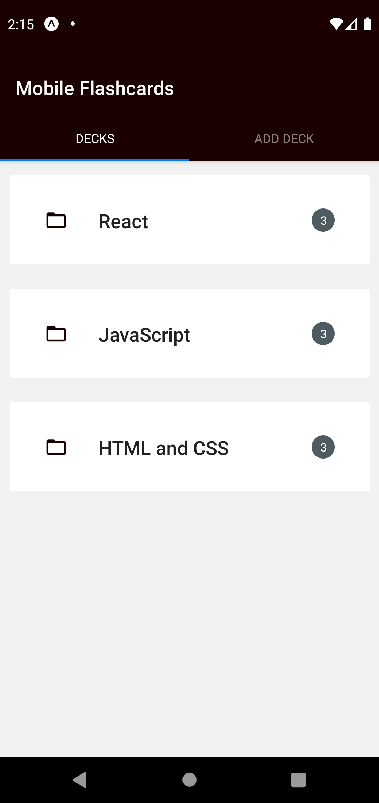
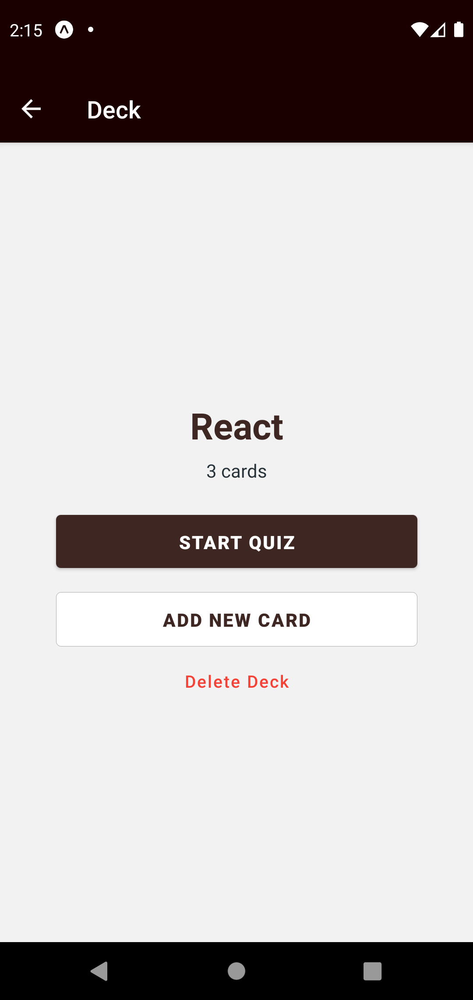
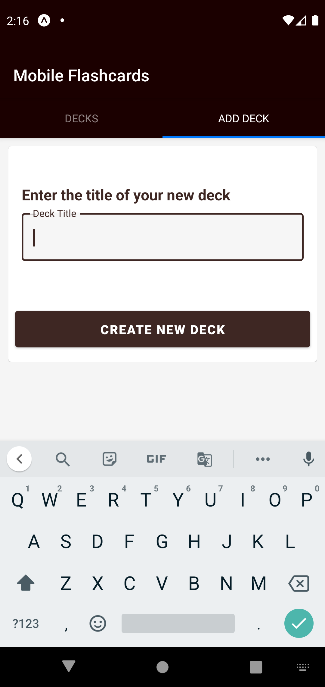
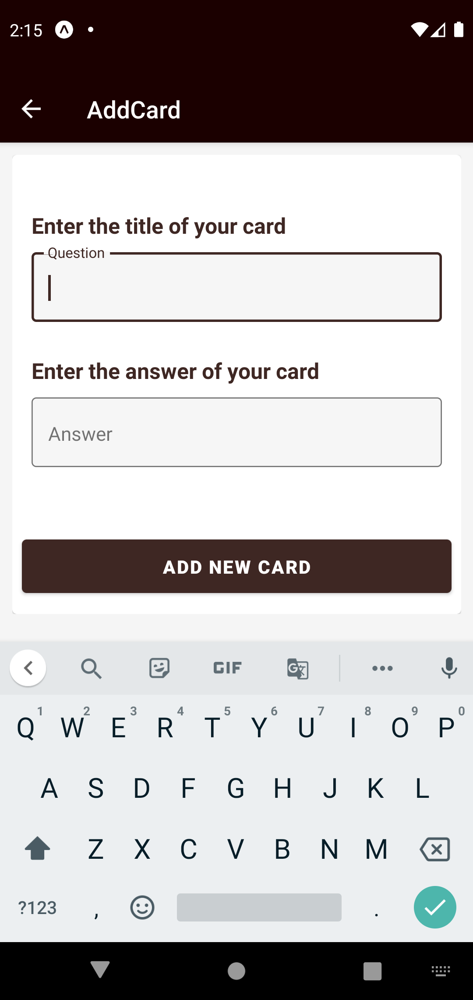
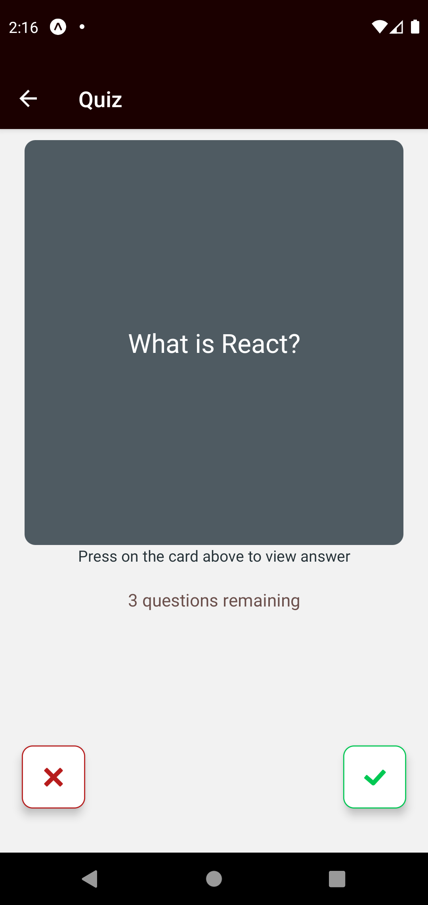
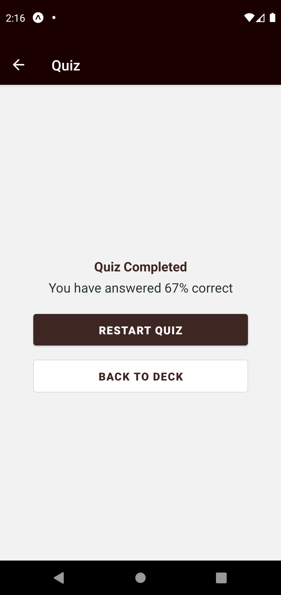

<h1>Mobile Flashcards React Native</h1>

This is the final project of udacity react nanodegree program.
The project focuses and allows users to create decks, cards and play quiz.

## Installation

Clone the repository, change directories, and use npm to install the dependencies.

```bash
$ git clone https://github.com/bibishan-pandey/flashcards.git
$ cd flashcards
$ npm start
```

## Tests

| Platform | Device                | Tested             |
| :------- | :-------------------- | :----------------- |
| iOS      | iPhone 11 (ios 14.2) | True |
| Android  | Pixel 4 (API 29)   | True |


## Screenshots












